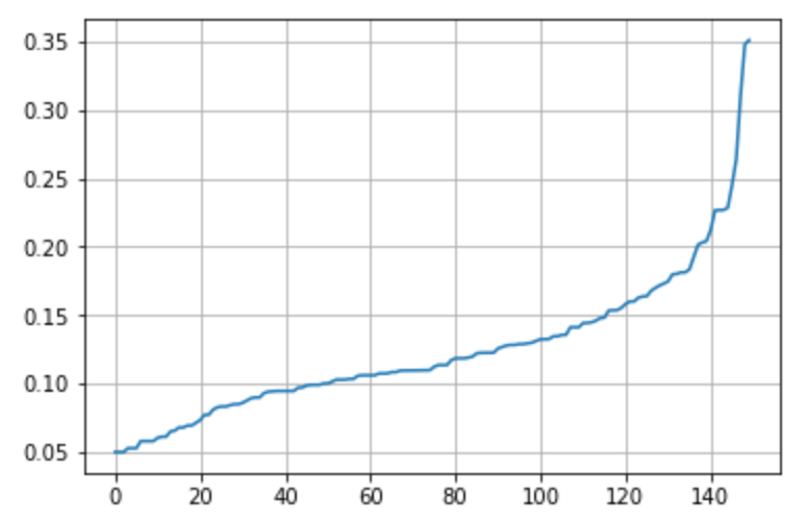
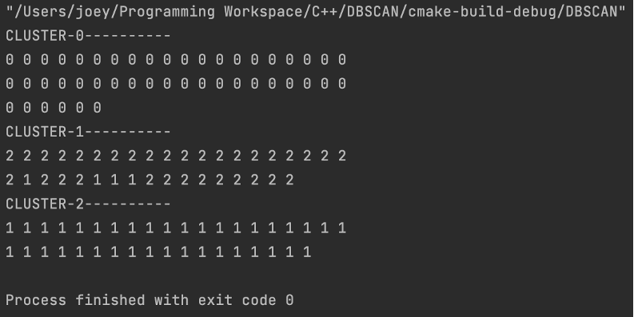

# DBSCAN
Implementation of DBSCAN clustering with C++11 and apply it on UCI_IRIS dataset.
According to pseudo-code provided by the bool "Machine Learning".

# Dataset
Iris Data Set[http://archive.ics.uci.edu/ml/datasets/Iris]. Or you can download dataset with 'downloadDataset.ipynb' and save to csv file with MaxMin normalization preprocess.

# Parameters

There is a guiding principle for the selection of MINPTS, MINPTS ≥ DIM +1, where DIM represents the dimension of data to be clustered. The characteristic dimension of IRIS in the data set used in this experiment is 4, so Minpts =5 is selected.

EPS value was determined by drawing the K-distance graph, and the value at the obvious inflection point of the K-distance graph was selected as EPS. So EPS=0.183 is selected as initial value.

After testing, EPS=0.135 is selected finally.

# Result

DBI = 2.2

# License
MIT License

Copyright (c) 2021 TongJiayan

